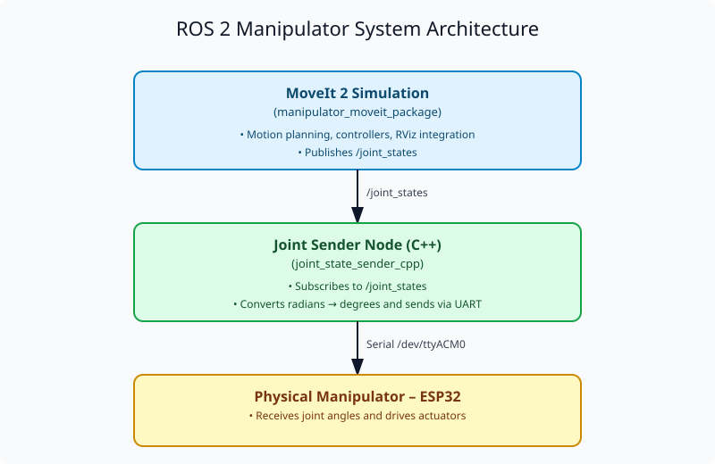

# 🦾 6DOF Industrial Robotic Manipulator

This engineering project focuses on the **design, simulation, and implementation** of a six-degree-of-freedom (6DOF) industrial robotic manipulator.
The manipulator is developed as a **scaled-down educational model** to study robotic kinematics, control strategies, and integration between simulation and physical systems.

The project includes:

* **Mechanical design** in Autodesk Fusion 360 (CAD),
* **3D-printed robot** for testing and control,
* **Digital twin** developed in **ROS 2 (Humble)** with Gazebo, RViz, and MoveIt 2,
* **Embedded control** on **ESP32-S3**, communicating with ROS 2 over UART,

The work was conducted as an **engineering thesis** under the supervision of
**Dr. Eng. Michał Błędowski** (Wrocław University of Science and Technology).

---

## 🧭 Repository Structure

```
engeniering_thesis_6dof_manipulator/
│
├── 3D_model/                  # CAD and STL models of each manipulator part
│
├── python_scripts/            # Helper scripts
│   ├── kinematics_check.py    # Python script for D-H table check
│   └── trans_calc.py          # Python script for symbolic calculations
│
├── manipulator_controler/     # Firmware project for ESP32-S3 (PlatformIO)
│   ├── src/main.cpp           # Main control logic
│   ├── include/, lib/, test/  # Support files and headers
│   └── README                 # Details about embedded control implementation
│
├── manipulator_urdf_export/   # Auto-generated ROS2 description from Fusion 360
│   ├── urdf/, meshes/, launch/ # URDF, Xacro, and RViz/Gazebo configurations
│   └── README.md              # Description of the simulation setup
│
├── ros_workspace/             # Full ROS 2 workspace with MoveIt and control nodes
│   ├── src/
│   │   ├── manipulator_ros2_description/   # URDF + launch files (RViz, Gazebo)
│   │   ├── manipulator_moveit_package/     # MoveIt 2 config and planning setup
│   │   ├── joint_state_sender_cpp/         # Node sending joint data via UART
│   │   └── ... (other dependencies)
│   └── README.md               # Workspace build and launch instructions
│
├── thesis_document/           # LaTeX source of the engineering thesis
|
├── photos_videos/             # Media from development and testing
│
└── README.md                  # You are here 😊
```

---

## ⚙️ Quick Start (ROS 2 Workspace)

To set up and run the digital twin:

```bash
cd ros_workspace
colcon build
source install/setup.bash
```

### Launch Options

* **Visualize manipulator in RViz**

  ```bash
  ros2 launch manipulator_ros2_description display.launch.py
  ```

* **Run MoveIt simulation with controllers**

  ```bash
  ros2 launch manipulator_moveit_package demo_with_controlers.launch.py
  ```

* **Send joint positions via serial (to ESP32)**

  ```bash
  ros2 run joint_state_sender_cpp joint_sender_node
  ```

---

## 🧩 System Architecture

A simplified overview of the integration between ROS 2 simulation and the physical manipulator:

<p align="center">
  
</p>

---

## 🔗 References

* [ROS 2 Documentation (Humble)](https://docs.ros.org/en/humble/index.html)
* [MoveIt 2 Tutorials](https://moveit.picknik.ai/main/doc/tutorials/tutorials.html)
* [Gazebo Sim](https://gazebosim.org/home)

---

## 📜 License

Distributed under the **MIT License**.
See individual package directories for license details.

---

## 👤 Author

**Michał Markuzel**
📧 [markuzel.michal@gmail.com](mailto:markuzel.michal@gmail.com)
